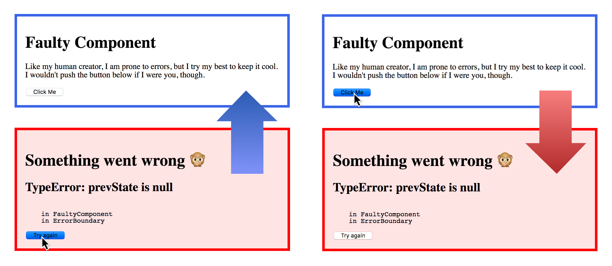

# Error Boundaries

## Example implementation

We're going to implement an `ErrorBoundary` component that catches any error in its children and displays a fallback UI when that happens:



```jsx

const initial_state = {
  state: null,
  info: null
};

class ErrorBoundary extends React.Component {

  constructor(props) {
    super(props);
    this.state = initial_state;
    this.reset = this.reset.bind(this);
  }
  
  componentDidCatch(error, info) {
    this.setState({ error: error, info: info });
  }

  reset() {
    this.setState(initial_state);
  }

  render() {
    let { error, info } = this.state;
    if (error) {
      return (
        <div className='error-boundary'>
          <h1>Something went wrong 🙊</h1>
          <h2>{ error.toString() }</h2>
          <pre>
            { info.componentStack }
          </pre>
          <button onClick={this.reset}>Try again</button>
        </div>
      );
    }
    return this.props.children;
  }
}
```

```jsx
class FaultyComponent extends React.Component {

  constructor(props) {
    super(props);
    this.break = this.break.bind(this);
  }

  break() {
    this.setState(
      prevState => ({ counter: prevState.counter + 1 })
    )
  }

  render() {
    return (
      <div className='faulty-component'>
        <h1>Faulty Component</h1>
        <p>
          Like my human creator, I am prone to errors, 
          but I try my best to keep it cool. 
          I wouldn't push the button below if I were you, though.
        </p>
        <button onClick={this.break}>Click Me</button>
      </div>
    );
  }
}
```

```jsx
<ErrorBoundary>
  <FaultyComponent/>
</ErrorBoundary>
```

